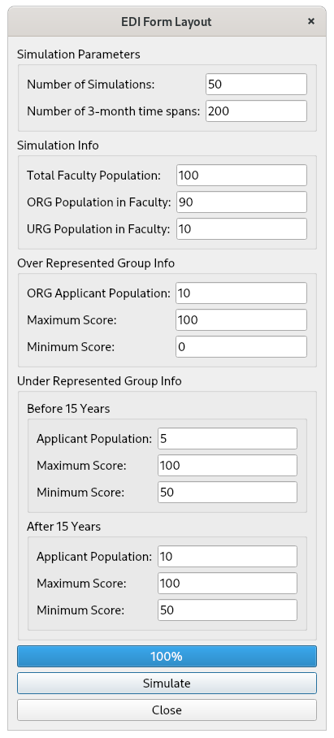
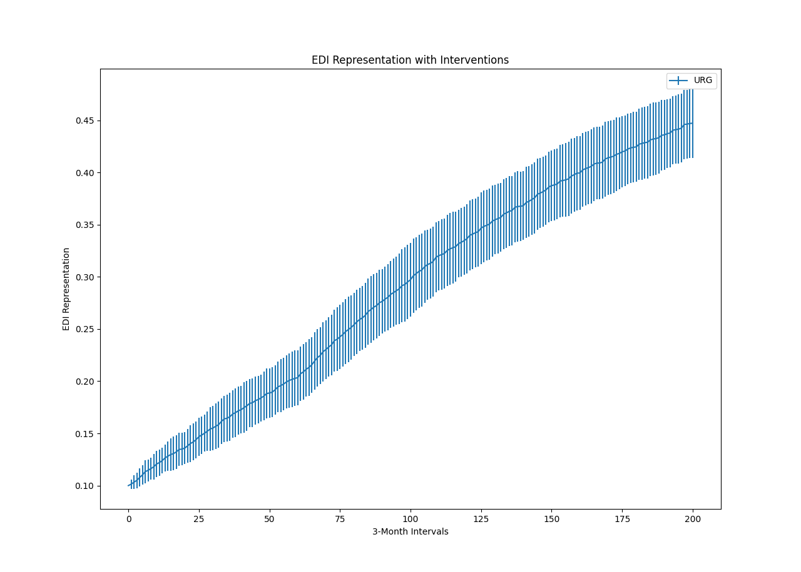
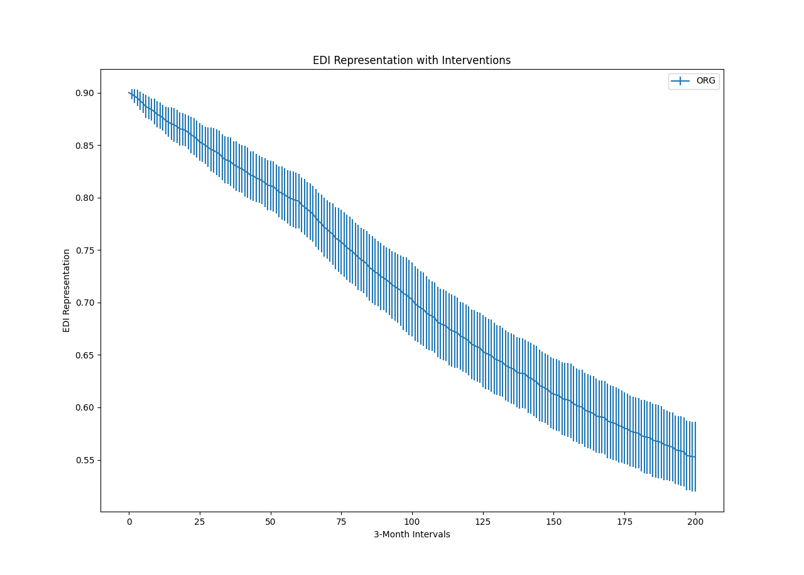

# GUI for an EDI Project

An agent based modeling approach used to investigate the impacts of various EDI hiring interventions. A graphical user interface is developed along with simulation of the agent based model. This software is built on the works of Friesen and McLeod [1].

# Modeling and Simulation

An over represented group is labeled ORG and an under represented group is labeled URG. The URG may be due to race, socioeconomic class, or other characteristics.

The hiring process modeled is one new individual **every 3 months**. The attrition rate is one individual per year, weighted in proportion to the percentage of ORG and URG individuals in the organization.

Fig. 1 - Under representative group EDI simulation.

Fig. 2 - Over representative group EDI simulation.

To find more details on the research refer the paper in the reference section. Also make sure to meed the dependencies by visiting the [requirements](ediSim/requirements.md) page.

# References

[1] M. R. Friesen, and R. D. McLeod, "Towards equitable hiring practices for engineering education institutions: An individual based simulation model", Winnipeg, 2020.
